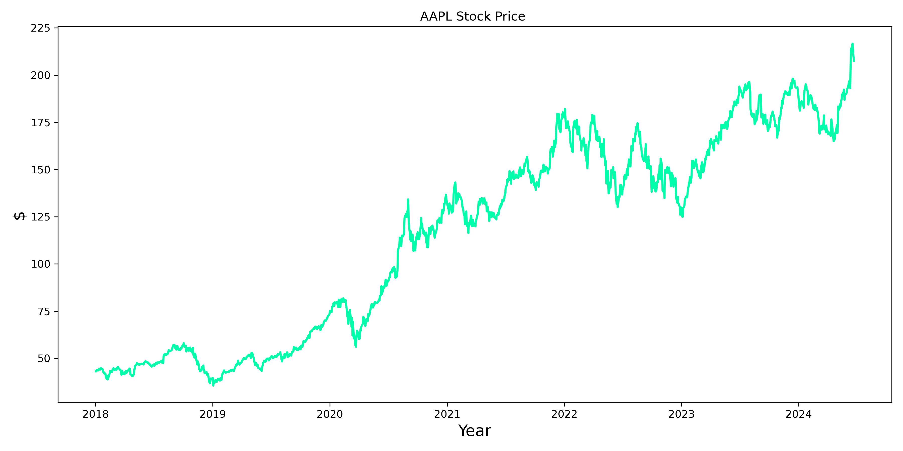
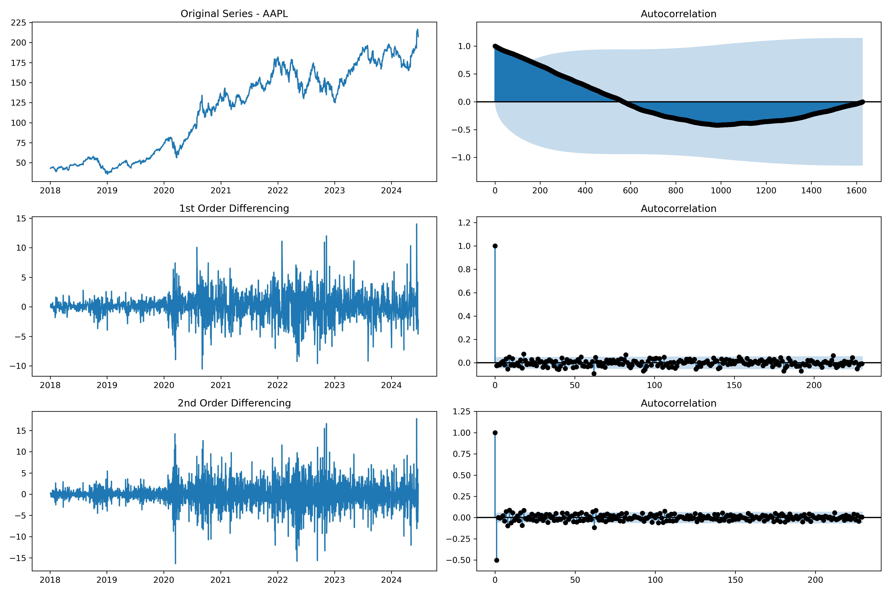
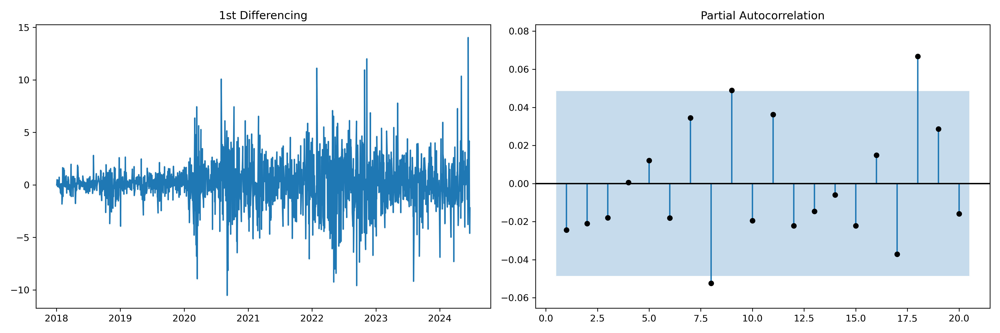
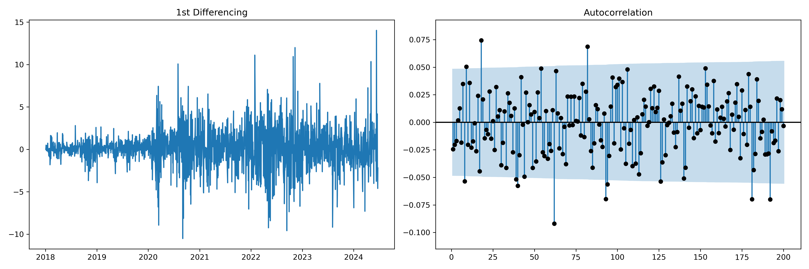
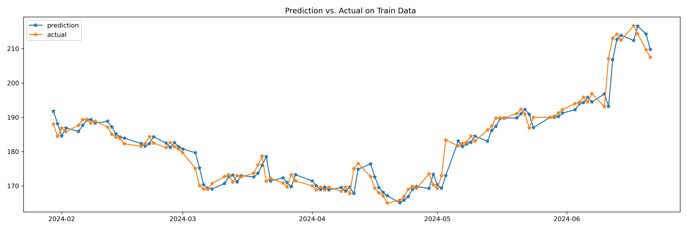
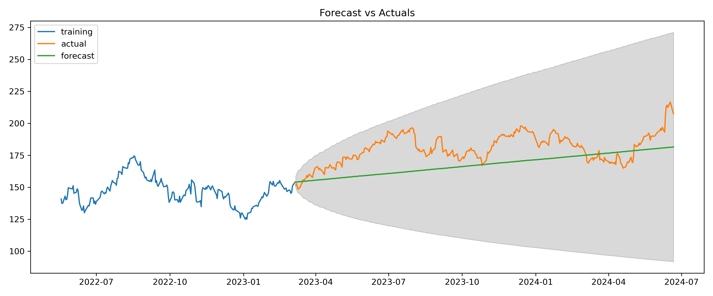

## 1. Introduction

Time series analysis is a fundamental technique in quantitative finance, particularly for understanding and predicting stock price movements. Among the various time series models, ARIMA (Autoregressive Integrated Moving Average) models have gained popularity due to their flexibility and effectiveness in capturing complex patterns in financial data.

This article will explore the application of time series analysis and ARIMA models to stock price prediction. We'll cover the theoretical foundations, practical implementation in Python, and critical considerations for using these models in real-world financial scenarios.

## 2. Fundamentals of Time Series Analysis

### Components of a Time Series

A time series typically consists of four components:

1. **Trend**: The long-term movement in the series
2. **Seasonality**: Regular, periodic fluctuations
3. **Cyclical**: Irregular fluctuations, often related to economic cycles
4. **Residual**: Random, unpredictable variations

Understanding these components is crucial for effective time series modeling.

### Stationarity

A key concept in time series analysis is stationarity. A stationary time series has constant statistical properties over time, including mean and variance. Many time series models, including ARIMA, assume stationarity. We often need to transform non-stationary data (like most stock price series) to achieve stationarity. Augmented Dickey-Fuller test can be used to check for stationarity, as showed in next sections.

## 3. ARIMA Models: Theoretical Background

ARIMA models combine three components:

1. **AR (Autoregressive)**: The model uses the dependent relationship between an observation and some number of lagged observations.
2. **I (Integrated)**: The use of differencing of raw observations to make the time series stationary.
3. **MA (Moving Average)**: The model uses the dependency between an observation and a residual error from a moving average model applied to lagged observations.

The ARIMA model is typically denoted as ARIMA(p,d,q), where:

- p is the order of the AR term
- d is the degree of differencing
- q is the order of the MA term

### Mathematical Representation

The ARIMA model can be written as:

$$
Y_t = c + \varphi_1 Y_{t-1} + \varphi_2 Y_{t-2} + ... + \varphi_p Y_{t-p} + \theta_1 \epsilon_{t-1} + \theta_2 \epsilon_{t-2} + ... + \theta_q \epsilon_{t-q} + \epsilon_t
$$

Where:

- $Y_t$ is the differenced series (it may have been differenced more than once)
- **c** is a constant
- $\phi_i$ are the parameters of the autoregressive part
- $\theta_i$ are the parameters of the moving average part
- $\epsilon_t$ is white noise

## 4. Implementing ARIMA Models in Python

Let's implement an ARIMA model for stock price prediction using Python and the statsmodels library:

```python
import numpy as np
import pandas as pd
import matplotlib.pyplot as plt
from statsmodels.tsa.arima.model import ARIMA
from statsmodels.tsa.stattools import adfuller
from sklearn.metrics import mean_squared_error
import yfinance as yf
import seaborn as sns

# Download stock data
ticker = "AAPL"
start_date = "2018-01-01"
end_date = "2024-06-23"
data = yf.download(ticker, start=start_date, end=end_date)

# Prepare the data
ts = data['Close']

# Check for stationarity
def test_stationarity(timeseries):
    result = adfuller(timeseries, autolag='AIC')
    print('ADF Statistic:', result[0])
    print('p-value:', result[1])
    return result[1]

# Plot the time-series
plt.figure(figsize=(12,6))
plt.plot(ts.index[:], ts.values[:], label='Observed')
plt.title(f'{ticker} Stock Price ')
# plt.legend()
plt.tight_layout()
plt.show()


p_val = test_stationarity(ts)

if p_val > 0.05:
    # If non-stationary, difference the series
    ts_diff = ts.diff().dropna()
    p_val = test_stationarity(ts_diff)
    d = 1
    if p_val > 0.05:
        ts_diff = ts.diff().diff().dropna()
        p_val = test_stationarity(ts_diff)
        d = 2

print(f"\nd = {d}")
```

> *Output:*
>
> d = 1



This script downloads stock data, checks for stationarity, fits an ARIMA model, makes predictions, and evaluates the model's performance. In this case, as expected from the plot, the time-series is not stationary. Hence, *d* has to be greater or equal to 1.

## 5. Model Selection and Diagnostic Checking

Choosing the right ARIMA model involves selecting appropriate values for p, d, and q. This process often involves:

1. **Analyzing ACF and PACF plots**: These help in identifying potential AR and MA orders.
2. **Grid search**: Trying different combinations of p, d, and q and selecting the best based on information criteria like AIC or BIC.
3. **Diagnostic checking**: Analyzing residuals to ensure they resemble white noise.

### Finding ARIMA Parameters (p, d, q)

Determining the optimal ARIMA parameters involves a combination of statistical tests, visual inspection, and iterative processes. Here's a systematic approach to finding p, d, and q:

* Determine d (Differencing Order):
  - Use the Augmented Dickey-Fuller test to check for stationarity.
  - If the series is not stationary, difference it and test again until stationarity is achieved.
* Determine p (AR Order) and q (MA Order):
  - After differencing, use ACF (Autocorrelation Function) and PACF (Partial Autocorrelation Function) plots.
  - The lag where the ACF cuts off indicates the q value.
  - The lag where the PACF cuts off indicates the p value.
* Fine-tune with Information Criteria:
  - Use AIC (Akaike Information Criterion) or BIC (Bayesian Information Criterion) to compare different models.

### Finding d parameter from plots

Since, the stationary was already checkd in the previous, this paragraph is useful for graphical and comphrension purpose. Moreover, with autocorrelation parameters, it is possible to find better values of d that the ADF test cannot recognize.

```python
from statsmodels.graphics.tsaplots import plot_acf, plot_pacf

plt.rcParams.update({'figure.figsize':(15,10), 'figure.dpi':80})

# Import data
df = data.copy()

# Original Series
fig, axes = plt.subplots(3, 2, sharex=False)
axes[0, 0].plot(df.index, df.Close); axes[0, 0].set_title('Original Series - '+ticker)
plot_acf(df.Close, ax=axes[0, 1], lags=len(df)-1, color='k', auto_ylims=True)

# 1st Differencing
axes[1, 0].plot(df.index, df.Close.diff()); axes[1, 0].set_title('1st Order Differencing')
plot_acf(df.Close.diff().dropna(), ax=axes[1, 1], lags=len(df)/7-2, color='k', auto_ylims=True)

# 2nd Differencing
axes[2, 0].plot(df.index, df.Close.diff().diff()); axes[2, 0].set_title('2nd Order Differencing')
plot_acf(df.Close.diff().diff().dropna(), ax=axes[2, 1], lags=len(df)/7-3, color='k', auto_ylims=True)

plt.tight_layout()
plt.show()
```



Indeed, from the plot, *d=2* is probably a better solution since we have few coefficient that goes above the confidence threshold.

### Finding p parameter from plots

As suggest previously, Partical Correlation Plot is adopted to find the **p** parameter.

```python
plt.rcParams.update({'figure.figsize':(15,5), 'figure.dpi':80})
fig, axes = plt.subplots(1, 2, sharex=False)
axes[0].plot(df.index, df.Close.diff()); axes[0].set_title('1st Differencing')
axes[1].set(ylim=(0,5))
plot_pacf(df.Close.diff().dropna(), ax=axes[1], lags=200, color='k', auto_ylims=True, zero=False)

plt.tight_layout()
plt.show()
```



A possible choice of **p** can 8 or 18, where the coefficient crosses the confidence intervals.

### Finding q parameter from plots

```python
plt.rcParams.update({'figure.figsize':(15,5), 'figure.dpi':80})
fig, axes = plt.subplots(1, 2, sharex=False)
axes[0].plot(df.Close.diff()); axes[0].set_title('1st Differencing')
axes[1].set(ylim=(0,1.2))
plot_acf(df.Close.diff().dropna(), ax=axes[1], lags=200, color='k', auto_ylims=True, zero=False)
plt.tight_layout()
plt.show()
```



ACF looks very similar to PCF for smaller lags. Hence, even in this case a value of 8 can be used as *q*.

## 6. ARIMA model fitting

### Predict ARIMA model on all data

```python
model = ARIMA(df.Close, order=(8,2,8)) # p,d,q
results = model.fit()
print(results.summary())

# Actual vs Fitted o
plt.plot(results.predict()[-100:], '-*', label='prediction')
plt.plot(df.Close[-100:], '-*', label='actual')
plt.legend()
plt.title("Prediction vs. Actual on All Data ")
plt.tight_layout()
plt.show()
```



### Train/ Test split

```python
from statsmodels.tsa.stattools import acf

# Create Training and Test
train = df.Close[:int(len(df)*0.8)]
test = df.Close[int(len(df)*0.8):]

# model = ARIMA(train, order=(3,2,1))  
model = ARIMA(train, order=(8, 2, 8))  
fitted = model.fit()  

# Forecast
fc = fitted.get_forecast(steps=len(test), alpha=0.05)  # 95% conf
conf = fc.conf_int()

# Make as pandas series
fc_series = pd.Series(fitted.forecast(steps=len(test)).values, index=test.index)
lower_series = pd.Series(conf.iloc[:, 0].values, index=test.index)
upper_series = pd.Series(conf.iloc[:, 1].values, index=test.index)

# Plot
plt.figure(figsize=(12,5), dpi=100)
plt.plot(train[-200:], label='training')
plt.plot(test, label='actual')
plt.plot(fc_series, label='forecast')
plt.fill_between(lower_series.index, lower_series, upper_series, 
                 color='k', alpha=.15)
plt.title('Forecast vs Actuals')
plt.legend(loc='upper left', fontsize=10)
plt.tight_layout()
plt.show()
```



```python
# Accuracy metrics
def forecast_accuracy(forecast, actual):
    mape = np.mean(np.abs(forecast - actual)/np.abs(actual))    # MAPE
    me = np.mean(forecast - actual)                             # ME
    mae = np.mean(np.abs(forecast - actual))                    # MAE
    mpe = np.mean((forecast - actual)/actual)                   # MPE
    rmse = np.mean((forecast - actual)**2)**.5                  # RMSE
    corr = np.corrcoef(forecast, actual)[0,1]                   # corr
    mins = np.amin(np.hstack([forecast[:,None], 
                              actual[:,None]]), axis=1)
    maxs = np.amax(np.hstack([forecast[:,None], 
                              actual[:,None]]), axis=1)
    minmax = 1 - np.mean(mins/maxs)                             # minmax
    acf1 = acf(forecast-test)[1]                                # ACF1
    return({'mape':mape, 'me':me, 'mae': mae, 
            'mpe': mpe, 'rmse':rmse, 'acf1':acf1, 
            'corr':corr, 'minmax':minmax})

forecast_accuracy(fc_series.values, test.values)
```

> Output:
>
> {'mape': 0.07829701788549515,
>
> 'me': -12.898037657120996,
>
> 'mae': 14.483068468837455,
>
> 'mpe': -0.068860507560246,
>
> 'rmse': 16.906382957008496,
>
> 'acf1': 0.9702976318229376,
>
> 'corr': 0.4484875181364141,
>
> 'minmax': 0.07810488835602647}

### Grid Search

```python
def grid_search_arima(train, test, p_range, d_range, q_range):
    best_aic = float('inf')
    best_mape = float('inf')
    best_order = None
    for p in p_range:
        for d in d_range:
            for q in q_range:
                try:
                    model = ARIMA(train.values, order=(p,d,q))
                    results = model.fit()
                    fc_series = pd.Series(results.forecast(steps=len(test)), index=test.index)  # 95% conf
                    test_metrics = forecast_accuracy(fc_series.values, test.values)
                    # if results.aic < best_aic:
                    #     best_aic = results.aic
                    #     best_order = (p,d,q)
                    print(p,d,q, test_metrics['mape'])
                    if test_metrics['mape'] < best_mape:
                        best_mape = test_metrics['mape']
                        best_order = (p,d,q)
                        print("temp best:", best_order, test_metrics['mape'])
                except Exception as e:
                    print(e)
                    continue
    return best_order

# Grid search for best p and q (assuming d is known)
best_order = grid_search_arima(train, test, range(1,9), [d, d+1], range(1,9))
print(f"Best ARIMA order based on grid search: {best_order}")
```

> Suggested d value: 1
>
> temp best: (1, 1, 1) 0.14570196898952395
>
> temp best: (1, 1, 5) 0.14514639508226412
>
> temp best: (1, 1, 6) 0.14499024417142595
>
> temp best: (1, 1, 7) 0.1439625731680348
>
> temp best: (1, 2, 1) 0.07729490750827837
>
> temp best: (1, 2, 2) 0.0764917667521908
>
> temp best: (3, 2, 4) 0.07647187068962996
>
> Best ARIMA order based on grid search: (3, 2, 4)

At the end, we found that *(3,2,4)* offer better testing results (mape of 7.6% vs. 7.8% of manual parameters finding), even if there is only a tiny difference (0.2%). Moreover, since the values of p and q are lower the model will be faster and less prone to overfitting (fewer number of AR or MA coefficients).

## 7. Limitations and Considerations

While ARIMA models can be powerful for time series prediction, they have limitations:

1. **Assumption of linearity**: ARIMA models assume linear relationships, which may not hold for complex financial data.
2. **Limited forecasting horizon**: They tend to perform poorly for long-term forecasts.
3. **Sensitivity to outliers**: Extreme values can significantly impact model performance.
4. **Assumption of constant variance**: This may not hold for volatile stock prices.
5. **No consideration of external factors**: ARIMA models only use past values of the time series, ignoring other potentially relevant variables.

## 8. Conclusion

Time series analysis and ARIMA models provide valuable tools for understanding and predicting stock price movements. While they have limitations, particularly in the complex and often non-linear world of financial markets, they serve as a strong foundation for more advanced modeling techniques.

When applying these models to real-world financial data, it's crucial to:

1. Thoroughly understand the underlying assumptions
2. Carefully preprocess and analyze the data
3. Conduct rigorous model selection and diagnostic checking
4. Interpret results with caution, considering the model's limitations
5. Combine with other analytical techniques and domain expertise for comprehensive analysis

As with all financial modeling, remember that past performance does not guarantee future results. Time series models should be one tool in a broader analytical toolkit, complemented by fundamental analysis, market sentiment assessment, and a deep understanding of the specific stock and its market context.

### Next Steps

In next articles, we are going to explore about time-series decomposition, seasanality, exogenous variables.
Indeed, several extensions to basic ARIMA models address some of these limitations:

1. **SARIMA**: Incorporates seasonality.
2. **ARIMAX**: Includes exogenous variables.
3. **GARCH**: Models time-varying volatility.
4. **Vector ARIMA**: Handles multiple related time series simultaneously.
