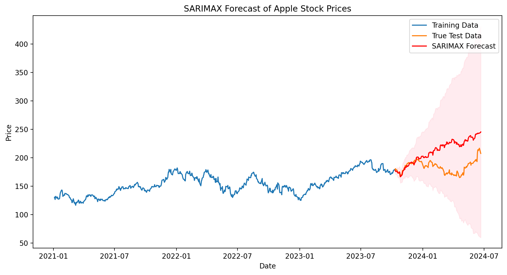

In the previous articles we saw the limitations of the [ARIMA](/posts/finance/stock_prediction/arima) and [SARIMA](/posts/finance/stock_prediction/sarima). Therefore, in this article we are going to implement a SARIMAX model the can include **exogenous variables**

## Introduction to Exogenous Variables in Time Series Models


Exogenous variables, also known as external regressors, are independent variables that are not part of the main time series but can influence it. In the context of stock price prediction, exogenous variables might include:

1. Market indices (e.g., S&P 500)
2. Economic indicators (e.g., GDP growth, unemployment rate)
3. Company-specific metrics (e.g., revenue, earnings per share)
4. Sentiment indicators (e.g., social media sentiment)

## Mathematical Formulation of SARIMAX

The SARIMAX model extends the SARIMA model by including exogenous variables. The mathematical representation is:

$$ φ(B)Φ(Bᵐ)(1-B)ᵈ(1-Bᵐ)D (Yₜ - β₁X₁,ₜ - β₂X₂,ₜ - ... - βₖXₖ,ₜ) = θ(B)Θ(Bᵐ)εₜ$$

Where:
- $Yₜ$ is the dependent variable (in our case, Apple stock price)
- $X₁,ₜ, X₂,ₜ, ..., Xₖ,$ₜ are the exogenous variables
- $β₁, β₂, ..., βₖ$ are the coefficients of the exogenous variables
- All other terms are as defined in the SARIMA model

## Implementing SARIMAX for Apple Stock

Let's implement a SARIMAX model for Apple stock, using the S&P 500 index as an exogenous variable:


```python
import pandas as pd
import numpy as np
import matplotlib.pyplot as plt
import yfinance as yf
from statsmodels.tsa.statespace.sarimax import SARIMAX
from pmdarima import auto_arima

# Download Apple stock data and S&P 500 data
start_date = "2021-01-01"
end_date = "2024-06-24"
aapl = yf.download("AAPL", start=start_date, end=end_date)['Close']
sp500 = yf.download("^GSPC", start=start_date, end=end_date)['Close']

# Align the data and remove any missing values
data = pd.concat([aapl, sp500], axis=1).dropna()
data.columns = ['AAPL', 'SP500']

# Split the data into train and test sets
train_size = int(len(data) * 0.8)
train, test = data[:train_size], data[train_size:]
test_size = len(test)

# Determine the best SARIMAX model
exog = train['SP500']
endog = train['AAPL']

model = auto_arima(endog, exogenous=exog, seasonal=True, m=12,
                   start_p=1, start_q=1, start_P=1, start_Q=1,
                   max_p=3, max_q=3, max_P=2, max_Q=2, d=1, D=1,
                   trace=True, error_action='ignore', suppress_warnings=True, 
                   stepwise=True, out_of_sample=200)

print(model.summary())

# Fit the SARIMAX model
sarimax_model = SARIMAX(endog, exog=exog, order=model.order, seasonal_order=model.seasonal_order)
results = sarimax_model.fit()

print(results.summary())
```

    Performing stepwise search to minimize aic
     ARIMA(1,1,1)(1,1,1)[12]             : AIC=inf, Time=1.82 sec
     ARIMA(0,1,0)(0,1,0)[12]             : AIC=3802.747, Time=0.04 sec
     ARIMA(1,1,0)(1,1,0)[12]             : AIC=3597.813, Time=0.15 sec
     ARIMA(0,1,1)(0,1,1)[12]             : AIC=inf, Time=0.99 sec
     ARIMA(1,1,0)(0,1,0)[12]             : AIC=3804.105, Time=0.04 sec
     ARIMA(1,1,0)(2,1,0)[12]             : AIC=3525.586, Time=0.34 sec
     ARIMA(1,1,0)(2,1,1)[12]             : AIC=inf, Time=2.90 sec
     ARIMA(1,1,0)(1,1,1)[12]             : AIC=inf, Time=1.09 sec
     ARIMA(0,1,0)(2,1,0)[12]             : AIC=3523.686, Time=0.26 sec
     ARIMA(0,1,0)(1,1,0)[12]             : AIC=3596.070, Time=0.08 sec
     ARIMA(0,1,0)(2,1,1)[12]             : AIC=inf, Time=2.63 sec
     ARIMA(0,1,0)(1,1,1)[12]             : AIC=inf, Time=0.80 sec
     ARIMA(0,1,1)(2,1,0)[12]             : AIC=3525.569, Time=0.34 sec
     ARIMA(1,1,1)(2,1,0)[12]             : AIC=3526.799, Time=0.70 sec
     ARIMA(0,1,0)(2,1,0)[12] intercept   : AIC=3525.686, Time=0.76 sec
    
    Best model:  ARIMA(0,1,0)(2,1,0)[12]          
    Total fit time: 12.965 seconds
                                         SARIMAX Results                                      
    ==========================================================================================
    Dep. Variable:                                  y   No. Observations:                  697
    Model:             SARIMAX(0, 1, 0)x(2, 1, 0, 12)   Log Likelihood               -1758.843
    Date:                            Sun, 07 Jul 2024   AIC                           3523.686
    Time:                                    00:01:08   BIC                           3537.270
    Sample:                                         0   HQIC                          3528.942
                                                - 697                                         
    Covariance Type:                              opg                                         
    ==============================================================================
                     coef    std err          z      P>|z|      [0.025      0.975]
    ------------------------------------------------------------------------------
    ar.S.L12      -0.6850      0.032    -21.233      0.000      -0.748      -0.622
    ar.S.L24      -0.3251      0.036     -9.102      0.000      -0.395      -0.255
    sigma2         9.9300      0.420     23.621      0.000       9.106      10.754
    ===================================================================================
    Ljung-Box (L1) (Q):                   0.09   Jarque-Bera (JB):                50.28
    Prob(Q):                              0.76   Prob(JB):                         0.00
    Heteroskedasticity (H):               1.34   Skew:                             0.10
    Prob(H) (two-sided):                  0.03   Kurtosis:                         4.31
    ===================================================================================
    
    Warnings:
    [1] Covariance matrix calculated using the outer product of gradients (complex-step).
    

    
### Plotting

```python
# Forecast
forecast_steps = len(test)
forecast = results.get_forecast(steps=forecast_steps, exog=test['SP500'])
forecast_ci = forecast.conf_int(alpha=0.1)

# Plot the forecast
plt.figure(figsize=(12, 6), dpi=200)
plt.plot(train.index, train['AAPL'], label='Training Data')
plt.plot(test.index, test['AAPL'], label='True Test Data')
plt.plot(test.index, forecast.predicted_mean, color='r', label='SARIMAX Forecast')
plt.fill_between(test.index, forecast_ci.iloc[:, 0], forecast_ci.iloc[:, 1], color='pink', alpha=0.3)
plt.title('SARIMAX Forecast of Apple Stock Prices')
plt.xlabel('Date')
plt.ylabel('Price')
plt.legend()
plt.show()

# Evaluate the model
from sklearn.metrics import mean_squared_error, mean_absolute_error
mse = mean_squared_error(test['AAPL'], forecast.predicted_mean)
mae = mean_absolute_error(test['AAPL'], forecast.predicted_mean)
rmse = np.sqrt(mse)
print(f'Mean Squared Error: {mse:.4f}')
print(f'Mean Absolute Error: {mae:.4f}')
print(f'Root Mean Squared Error: {rmse:.4f}')

# Check the impact of the exogenous variable
print(results.summary())
```

    

    


> Mean Squared Error: 1235.4975
>
> Mean Absolute Error: 28.1924
>
> Root Mean Squared Error: 35.1496

```
                                         SARIMAX Results                                      
    ==========================================================================================
    Dep. Variable:                               AAPL   No. Observations:                  697
    Model:             SARIMAX(0, 1, 0)x(2, 1, 0, 12)   Log Likelihood               -1385.522
    Date:                            Sun, 07 Jul 2024   AIC                           2779.044
    Time:                                    00:01:09   BIC                           2797.156
    Sample:                                         0   HQIC                          2786.053
                                                - 697                                         
    Covariance Type:                              opg                                         
    ==============================================================================
                     coef    std err          z      P>|z|      [0.025      0.975]
    ------------------------------------------------------------------------------
    SP500          0.0475      0.001     37.409      0.000       0.045       0.050
    ar.S.L12      -0.6961      0.027    -25.701      0.000      -0.749      -0.643
    ar.S.L24      -0.3266      0.032    -10.212      0.000      -0.389      -0.264
    sigma2         3.3320      0.127     26.340      0.000       3.084       3.580
    ===================================================================================
    Ljung-Box (L1) (Q):                   1.59   Jarque-Bera (JB):               153.93
    Prob(Q):                              0.21   Prob(JB):                         0.00
    Heteroskedasticity (H):               0.98   Skew:                            -0.02
    Prob(H) (two-sided):                  0.87   Kurtosis:                         5.32
    ===================================================================================
    
    Warnings:
    [1] Covariance matrix calculated using the outer product of gradients (complex-step).
```

This model provide a good forecast for the first 20 candles, then it loses accuracy incrementally after that period (as the confidence levels diverges). A solution could be to retrain the model each month or some other arbitrary period. In the next section, we will see how to perform that in a simple way.

## Update Model each month


```python
predictions = []
conf_inters = []
step = 20  # one month has 20 tradable days


for i in range(0, test_size, step):
    # Split the data into train and test sets
    train_size = int(len(data) * 0.8) + i
    train, test = data[:train_size], data[train_size:train_size+step]

    # Determine the best SARIMAX model
    exog = train['SP500']
    endog = train['AAPL']

    # Fit the SARIMAX model
    sarimax_model = SARIMAX(endog, exog=exog, order=model.order, seasonal_order=model.seasonal_order)
    results = sarimax_model.fit()
    
    # Forecast
    forecast_steps = len(test)
    forecast = results.get_forecast(steps=forecast_steps, exog=test['SP500'])
    forecast_ci = forecast.conf_int()

    predictions.append(forecast.predicted_mean)
    conf_inters.append(forecast_ci)

    # print(i, forecast_steps) 

```

### Plotting
```python
# Concatenate predictions list
forecasts = pd.concat(predictions)
forecasts_ci = pd.concat(conf_inters)

# Split the data into train and test sets
train_size = int(len(data) * 0.8)
train, test = data[:train_size], data[train_size:]
test_size = len(test)

# Plot the forecast
plt.figure(figsize=(12, 6), dpi=200)
plt.plot(train.index[-200:], train['AAPL'].iloc[-200:], label='Training Data', color="#5e64f2")
plt.plot(test.index, test['AAPL'], label='True Test Data', color="#b76426")
plt.plot(test.index, forecasts, color='g', label='SARIMAX Forecast')
plt.fill_between(test.index, forecasts_ci.iloc[:, 0], forecasts_ci.iloc[:, 1], color='blue', alpha=0.1)
plt.title('SARIMAX Forecast of Apple Stock Prices using SP500 as exogenous data')
plt.xlabel('Date')
plt.ylabel('Price')
plt.legend()
plt.show()

# Evaluate the model
from sklearn.metrics import mean_squared_error, mean_absolute_error
mse = mean_squared_error(test['AAPL'], forecasts)
mae = mean_absolute_error(test['AAPL'], forecasts)
rmse = np.sqrt(mse)
print(f'Mean Squared Error: {mse:.4f}')
print(f'Mean Absolute Error: {mae:.4f}')
print(f'Root Mean Squared Error: {rmse:.4f}')
```


    

    


>    Mean Squared Error: 72.5481
>
>    Mean Absolute Error: 5.9930
>
>    Root Mean Squared Error: 8.5175
    


## Interpreting the Results

When interpreting the SARIMAX model results, pay attention to:

1. The coefficient and p-value of the exogenous variable (S&P 500 in this case). A low p-value indicates that the S&P 500 is a significant predictor of Apple's stock price.

2. The AIC (Akaike Information Criterion) of the SARIMAX model compared to the SARIMA model without exogenous variables. A lower AIC suggests a better model fit.

3. The forecast accuracy metrics (MSE, MAE, RMSE) compared to the model without exogenous variables.

As expected from the "*update*" method, the MAE is much lower (6 against 28 of the previous one). In particular a 1-year forecast is a too far prediction for the model. Hence updating the model (retraining) each month can lead to much better results.

## Advantages of Including Exogenous Variables

1. **Improved Accuracy**: Exogenous variables can capture external influences on the stock price, potentially leading to more accurate predictions.

2. **Better Understanding of Relationships**: The model provides insights into how external factors affect the stock price.

3. **Flexibility**: You can include multiple exogenous variables to capture different aspects of the market or economy.

## Limitations and Considerations

1. **Data Availability**: Ensuring that you have future values of exogenous variables for forecasting can be challenging.

2. **Overfitting Risk**: Including too many exogenous variables can lead to overfitting.

3. **Assumption of Linear Relationships**: SARIMAX assumes linear relationships between the exogenous variables and the target variable.

4. **Stationarity**: Exogenous variables should ideally be stationary or differenced to achieve stationarity.

## Conclusion

Incorporating exogenous variables through a SARIMAX model can significantly enhance our ability to forecast Apple stock prices. By including relevant external factors like the S&P 500 index, we can capture broader market trends that influence individual stock performance.

However, it's crucial to carefully select exogenous variables based on domain knowledge and to rigorously test their impact on model performance. Always validate your model using out-of-sample data and consider combining statistical forecasts with fundamental analysis for a comprehensive investment strategy.
