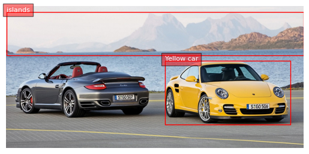
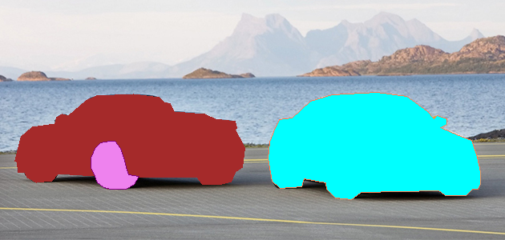
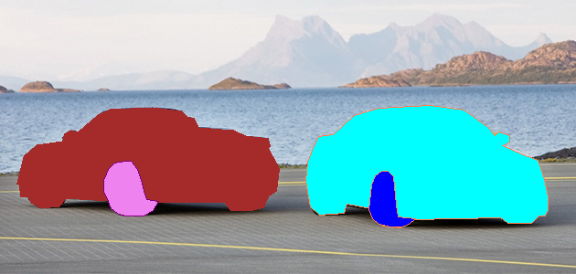
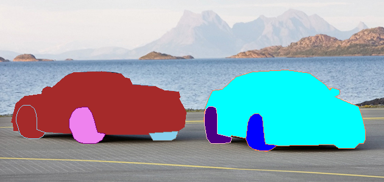
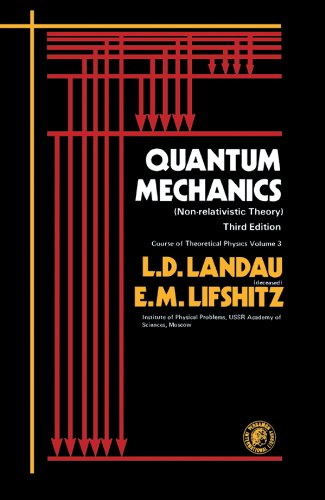

## Install dependencies

Type the following command to install possible needed dependencies (especially if the inference is performed on the CPU)

```python
%pip install einops flash_attn
```

In Kaggle, `transformers` and `torch` are already installed. Otherwise you also need to install them on your local PC.

## Import Libraries

```python
from transformers import AutoProcessor, AutoModelForCausalLM  
from PIL import Image
import requests
import copy
import torch
%matplotlib inline  
```

## Import the model

We can choose *Florence-2-large* or *Florence-2-large-ft* (fine-tuned).

```python
model_id = 'microsoft/Florence-2-large-ft'
device = torch.device("cuda" if torch.cuda.is_available() else "cpu")
print(device)
model = AutoModelForCausalLM.from_pretrained(model_id, trust_remote_code=True).eval()
model = model.to(device)      # put the model on the available GPU
processor = AutoProcessor.from_pretrained(model_id, trust_remote_code=True)

```

## Define inference function

```python
def run_inference(task_prompt, text_input=None):
    if text_input is None:
        prompt = task_prompt
    else:
        prompt = task_prompt + text_input
    inputs = processor(text=prompt, images=image, return_tensors="pt").to(device)
    generated_ids = model.generate(
      input_ids=inputs["input_ids"],
      pixel_values=inputs["pixel_values"],
      max_new_tokens=1024,
      early_stopping=False,
      do_sample=False,
      num_beams=3,
    )
    generated_text = processor.batch_decode(generated_ids, skip_special_tokens=False)[0]
    parsed_answer = processor.post_process_generation(
        generated_text, 
        task=task_prompt, 
        image_size=(image.width, image.height)
    )

    return parsed_answer
```

## Get image link

```python
image_url = "http://lerablog.org/wp-content/uploads/2013/06/two-cars.jpg"  # an arbitrary image link or filepath can be inserted here
image = Image.open(requests.get(image_url, stream=True).raw)
image
```


## Run pre-defined tasks without additional inputs

### Caption

```python
task_prompt = '<CAPTION>'
run_inference(task_prompt)
```

> {'<CAPTION>': 'Two sports cars parked next to each other on a road.'}

```python
task_prompt = '<DETAILED_CAPTION>'
run_inference(task_prompt)
```

> {'<DETAILED_CAPTION>': 'In this image we can see two cars on the road. In the background, we can also see water, hills and the sky.'}

```python
task_prompt = '<MORE_DETAILED_CAPTION>'
run_inference(task_prompt)
```

> {'<MORE_DETAILED_CAPTION>': 'There are two cars parked on the street. There is water behind the cars. There are mountains behind the water. The cars are yellow and black. '}

## Object Detection

```python
task_prompt = '<OD>'
results = run_inference(task_prompt)
print(results)
```

<!-- {'<OD>': {'bboxes': [[336.1050109863281, 115.95000457763672, 599.4450073242188, 248.5500030517578], [18.584999084472656, 117.45000457763672, 304.6050109863281, 236.25001525878906], [113.08499908447266, 177.15000915527344, 172.30499267578125, 235.95001220703125], [404.1449890136719, 187.95001220703125, 454.54498291015625, 248.25001525878906], [336.1050109863281, 176.25, 380.2049865722656, 235.95001220703125], [26.774999618530273, 173.85000610351562, 73.3949966430664, 228.15000915527344], [244.125, 216.15000915527344, 291.375, 231.15000915527344], [546.5250244140625, 236.5500030517578, 588.7349853515625, 245.85000610351562], [481.635009765625, 148.35000610351562, 509.3550109863281, 157.65000915527344]], 'labels': ['car', 'car', 'wheel', 'wheel', 'wheel', 'wheel', 'wheel', 'wheel', 'wheel']}} -->

```python
import matplotlib.pyplot as plt  
import matplotlib.patches as patches  
def plot_bbox(image, data):
   # Create a figure and axes  
    fig, ax = plt.subplots()  
  
    # Display the image  
    ax.imshow(image)  
  
    # Plot each bounding box  
    for bbox, label in zip(data['bboxes'], data['labels']):  
        # Unpack the bounding box coordinates  
        x1, y1, x2, y2 = bbox  
        # Create a Rectangle patch  
        rect = patches.Rectangle((x1, y1), x2-x1, y2-y1, linewidth=1, edgecolor='r', facecolor='none')  
        # Add the rectangle to the Axes  
        ax.add_patch(rect)  
        # Annotate the label  
        plt.text(x1, y1, label, color='white', fontsize=8, bbox=dict(facecolor='red', alpha=0.5))  
  
    # Remove the axis ticks and labels  
    ax.axis('off')  
  
    # Show the plot  
    plt.show()  
```

---

```python
plot_bbox(image, results['<OD>'])
```


## Dense Region Caption

```python
task_prompt = '<DENSE_REGION_CAPTION>'
results = run_inference(task_prompt)
dense_region_res = results
print(results)
```

> {'<DENSE_REGION_CAPTION>': {'bboxes': [[334.8450012207031, 115.95000457763672, 599.4450073242188, 248.5500030517578], [18.584999084472656, 117.45000457763672, 304.6050109863281, 236.> 25001525878906], [113.71499633789062, 177.15000915527344, 172.30499267578125, 235.95001220703125], [404.1449890136719, 187.95001220703125, 453.9150085449219, 248.25001525878906], [26.> 774999618530273, 173.85000610351562, 73.3949966430664, 228.15000915527344], [336.1050109863281, 176.25, 380.2049865722656, 235.95001220703125], [244.125, 216.45001220703125,
> 290.7449951171875, 230.85000610351562], [546.5250244140625, 236.5500030517578, 588.7349853515625, 245.85000610351562], [481.635009765625, 148.35000610351562, 509.3550109863281,
> 157.65000915527344]], 'labels': ['yellow sports car', 'sports car', 'wheel', 'wheel', 'wheel', 'wheel', 'wheel', 'wheel', 'wheel']}}

```python
plot_bbox(image, results['<DENSE_REGION_CAPTION>'])
```

<!--  -->


## Phrase Grounding

```python
task_prompt = '<CAPTION_TO_PHRASE_GROUNDING>'
results = run_inference(task_prompt, text_input="Yellow car with islands in background")
print(results)
plot_bbox(image, results['<CAPTION_TO_PHRASE_GROUNDING>'])
```

{'<CAPTION_TO_PHRASE_GROUNDING>': {'bboxes': [[335.4750061035156, 115.6500015258789, 601.9649658203125, 250.35000610351562], [0.3149999976158142, 12.15000057220459, 629.0549926757812, 103.6500015258789]], 'labels': ['Yellow car', 'islands']}}


## Segmentation

```python
task_prompt = '<REFERRING_EXPRESSION_SEGMENTATION>'
results = run_inference(task_prompt, text_input="yellow car and island")
print(results)
```

<!-- {'<REFERRING_EXPRESSION_SEGMENTATION>': {'polygons': [[[348.07501220703125, 149.85000610351562, 364.4549865722656, 147.75, 387.135009765625, 126.75000762939453, 414.8550109863281, 118.35000610351562, 473.44500732421875, 116.25000762939453, 508.7250061035156, 120.45000457763672, 538.3350219726562, 147.15000915527344, 545.2650146484375, 145.0500030517578, 557.2349853515625, 149.25, 557.864990234375, 156.15000915527344, 547.7849731445312, 159.75, 572.9849853515625, 169.65000915527344, 588.7349853515625, 178.0500030517578, 596.9249877929688, 202.65000915527344, 599.4450073242188, 223.65000915527344, 596.9249877929688, 236.25001525878906, 588.7349853515625, 237.75001525878906, 579.2849731445312, 246.15000915527344, 553.4550170898438, 246.15000915527344, 547.1549682617188, 239.85000610351562, 450.135009765625, 239.85000610351562, 438.79498291015625, 248.25001525878906, 419.2649841308594, 248.25001525878906, 407.92498779296875, 237.75001525878906, 406.6650085449219, 229.35000610351562, 378.94500732421875, 225.15000915527344, 376.42498779296875, 233.5500030517578, 348.07501220703125, 235.65000915527344, 339.2550048828125, 225.15000915527344, 336.1050109863281, 198.45001220703125, 336.7349853515625, 175.95001220703125, 343.6650085449219, 159.75]]], 'labels': ['']}} -->

```python
from PIL import Image, ImageDraw, ImageFont 
import random
import numpy as np

colormap = ['blue','orange','green','purple','brown','pink','gray','olive','cyan','red',
            'lime','indigo','violet','aqua','magenta','coral','gold','tan','skyblue']

def draw_polygons(image, prediction, fill_mask=False):  
    """  
    Draws segmentation masks with polygons on an image.  
  
    Parameters:  
    - image_path: Path to the image file.  
    - prediction: Dictionary containing 'polygons' and 'labels' keys.  
                  'polygons' is a list of lists, each containing vertices of a polygon.  
                  'labels' is a list of labels corresponding to each polygon.  
    - fill_mask: Boolean indicating whether to fill the polygons with color.  
    """  
    # Load the image  
   
    draw = ImageDraw.Draw(image)  
  
   
    # Set up scale factor if needed (use 1 if not scaling)  
    scale = 1  
  
    # Iterate over polygons and labels  
    for polygons, label in zip(prediction['polygons'], prediction['labels']):  
        color = random.choice(colormap)  
        fill_color = random.choice(colormap) if fill_mask else None  
    
        for _polygon in polygons:  
            _polygon = np.array(_polygon).reshape(-1, 2)  
            if len(_polygon) < 3:  
                print('Invalid polygon:', _polygon)  
                continue  
        
            _polygon = (_polygon * scale).reshape(-1).tolist()  
        
            # Draw the polygon  
            if fill_mask:  
                draw.polygon(_polygon, outline=color, fill=fill_color)  
            else:  
                draw.polygon(_polygon, outline=color)  
        
            # Draw the label text  
            draw.text((_polygon[0] + 8, _polygon[1] + 2), label, fill=color)  
  
    # Save or display the image  
    #image.show()  # Display the image  
    display(image)
```

```python
output_image = copy.deepcopy(image)
draw_polygons(output_image, results['<REFERRING_EXPRESSION_SEGMENTATION>'], fill_mask=True)  
```


### Regions Segmentation

```python
def bbox_to_loc(bbox):
    # bbox position need to be rescaled from 0 to 999. the coordinates are x1_y1_x2_y2
    return f"<loc_{int(bbox[0]*999/width)}><loc_{int(bbox[1]*999/height)}><loc_{int(bbox[2]*999/width)}><loc_{int(bbox[3]*999/height)}>"

with torch.no_grad():
    torch.cuda.empty_cache()
```

```python
output_image = copy.deepcopy(image)
height, width = image.height, image.width 
task_prompt = '<REGION_TO_SEGMENTATION>'

for bbox in dense_region_res['<DENSE_REGION_CAPTION>']['bboxes'][:]:
    print(bbox_to_loc(bbox))
    results = run_inference(task_prompt, text_input=bbox_to_loc(bbox)) 
    draw_polygons(output_image, results[task_prompt], fill_mask=True)  
  
plot_bbox(output_image, dense_region_res['<DENSE_REGION_CAPTION>'])
```

> <loc_530><loc_386><loc_950><loc_827>
> 

> <loc_29><loc_391><loc_483><loc_786>
> 

> <loc_180><loc_589><loc_273><loc_785>
> 

> <loc_640><loc_625><loc_719><loc_826>
> 

> <loc_42><loc_578><loc_116><loc_759>
> 

> <loc_532><loc_586><loc_602><loc_785>
> 

> <loc_387><loc_720><loc_461><loc_768>
> 

> <loc_866><loc_787><loc_933><loc_818>
> 

> <loc_763><loc_494><loc_807><loc_524>
> 

> 

## OCR

```python
url = "https://m.media-amazon.com/images/I/510sf0pRTlL.jpg"
image = Image.open(requests.get(url, stream=True).raw).convert('RGB')
image
```



```python
task_prompt = '<OCR_WITH_REGION>'
results = run_inference(task_prompt)
print(results)
```

> {'<OCR_WITH_REGION>': {'quad_boxes': [[143.8125, 146.25, 280.9624938964844, 146.25, 280.9624938964844, 172.25, 143.8125, 172.25], [134.0625, 176.25, 281.9375, 176.25, 281.9375, 202.25, 134.0625, 202.25], [172.73748779296875, 206.25, 284.2124938964844, 206.25, 284.2124938964844, 216.25, 172.73748779296875, 216.25], [150.3125, 238.25, 281.9375, 238.25, 281.9375, 247.25, 150.3125, 247.25], [139.58749389648438, 254.25, 284.2124938964844, 254.25, 284.2124938964844, 277.75, 139.58749389648438, 277.75], [133.08749389648438, 283.75, 285.1875, 283.75, 285.1875, 307.75, 133.08749389648438, 307.75], [140.5625, 312.75, 281.9375, 312.75, 281.9375, 320.75, 140.5625, 320.75]], 'labels': ['</s>**QUANTUM', 'MECHANICS', '(Non-relativistic Theory)', 'Course of Theoretical Phyias Volume 3', 'L.D. LANDAU', 'E.M. LIFSHITZ', 'Initiute of Physical Problems, USSR Academy of**']}}

The overall extracted text from the image is very close to the original one. However, since the image resolution is low, the accuracy on the extracted text is quite low.

```python
def draw_ocr_bboxes(image, prediction):
    scale = 1
    draw = ImageDraw.Draw(image)
    bboxes, labels = prediction['quad_boxes'], prediction['labels']
    for box, label in zip(bboxes, labels):
        color = random.choice(colormap)
        new_box = (np.array(box) * scale).tolist()
        draw.polygon(new_box, width=3, outline=color)
        draw.text((new_box[0]-8, new_box[1]-10),
                    "{}".format(label),
                    align="right",
                    fill=color)
    display(image)

output_image = copy.deepcopy(image)
draw_ocr_bboxes(output_image, results['<OCR_WITH_REGION>'])  
```


