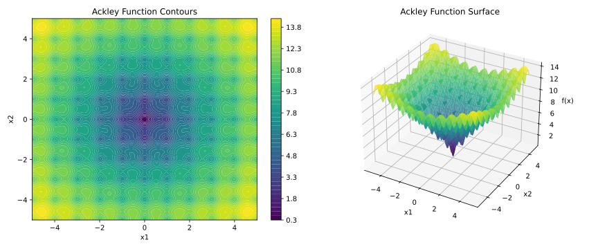
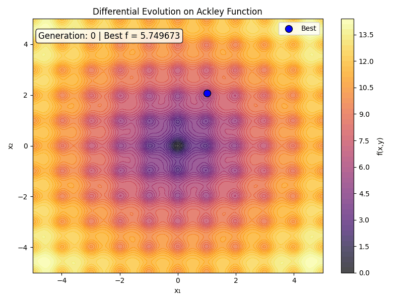

# Beyond the Gradient: Master Global Optimization with Differential Evolution

If you have spent any time in the machine learning world, you are likely intimately familiar with Gradient Descent and its various turbo-charged derivatives (like Adam or RMSprop). Gradients are wonderful—assuming your optimization landscape is as smooth and predictable as a bowling green.

But what happens when your loss landscape looks less like a gentle bowl and more like a jagged mountain range after an earthquake?

When gradients lie to you, trap you in local minima, or simply refuse to exist because your objective function is non-differentiable, it’s time to change paradigms. Enter **Differential Evolution (DE)**: a population-based, stochastic global optimizer that doesn't care about your gradients, doesn't cry over discontinuities, and systematically hunts down global minima.

In this guide, we will unpack how DE works from first principles, dissect its mathematical core, implement a complete evaluation framework in Python, and visualize its conquest over a notoriously deceptive benchmark function.

---

## 1. The Mathematical Battlefield: The Ackley Function

To see why we need Differential Evolution, we need an objective function designed specifically to break traditional optimizers. The **Ackley Function** is a classic multimodal test landscape characterized by a flat outer region littered with hundreds of deceptive local minima, all surrounding a single, incredibly sharp hole containing the true global minimum at $(0,0)$.

Mathematically, for a $d$-dimensional vector $\mathbf{x}$, it is expressed as:$$
f(\mathbf{x}) = -a \exp\left(-b \sqrt{\frac{1}{d} \sum_{i=1}^d x_i^2}\right) - \exp\left(\frac{1}{d} \sum_{i=1}^d \cos(c x_i)\right) + a + \exp(1)$$

Where standard benchmark constants are typically set to $a = 20$, $b = 0.2$, and $c = 2\pi$.

* **The first exponential term** creates the macro-topography: a large, sloping bowl determined by the Euclidean distance to the origin.
* **The second exponential term** uses cosine waves to superimpose high-frequency, periodic ripples across the entire landscape. This creates the matrix of local traps.

Trying to run standard gradient descent here is like trying to find a dropped contact lens in a dark room covered in bubble wrap; your local optimizer will happily fall into the nearest tiny pocket and declare victory, completely oblivious to the massive sinkhole just a few steps away.



## 2. Differential Evolution from First Principles

Differential Evolution avoids the local minimum trap by maintaining a *population* of candidate solutions that explore the space simultaneously. Instead of calculating a derivative to see which way is "down," DE uses the *spatial differences between its own individuals* to guide its search steps.

The algorithm operates in a continuous generational loop consisting of four fundamental phases:

### Step 1: Initialization

We instantiate a population of $NP$ vectors in a $d$-dimensional space. Each candidate solution $i$ at generation $g$ is represented as:$$
\mathbf{x}_i^{(g)} = [x_{i,1}^{(g)}, x_{i,2}^{(g)}, \dots, x_{i,d}^{(g)}]$$

These vectors are distributed uniformly across the user-defined upper and lower bounds of the search space.

### Step 2: Mutation

For each target vector $\mathbf{x}_i^{(g)}$, we randomly select three *distinct* individuals from our population: $\mathbf{x}_{r_1}^{(g)}$, $\mathbf{x}_{r_2}^{(g)}$, and $\mathbf{x}_{r_3}^{(g)}$, such that $r_1 \neq r_2 \neq r_3 \neq i$.

We calculate the difference vector between two of them, scale it by a mutation factor $F \in [0, 2]$, and add it to the third. This yields a **mutant vector** $\mathbf{v}_i^{(g+1)}$:$$
\mathbf{v}_i^{(g+1)} = \mathbf{x}_{r_1}^{(g)} + F \cdot \left(\mathbf{x}_{r_2}^{(g)} - \mathbf{x}_{r_3}^{(g)}\right)$$

> **Why this is brilliant:** Early in the optimization run, the individuals are highly scattered, making the difference vector large. This forces the algorithm to take massive exploratory steps. As the population naturally converges on a promising basin, the individuals get closer together, causing the difference vector to automatically shrink. DE inherently scales its step sizes based on its structural confidence!

### Step 3: Crossover (Recombination)

To maintain diversity and prevent the population from cloning itself too quickly, we mix components of the original target vector $\mathbf{x}_i^{(g)}$ and our newly minted mutant vector $\mathbf{v}_i^{(g+1)}$ to construct a **trial vector** $\mathbf{u}_i^{(g+1)}$.

For each dimension $j \in \{1, \dots, d\}$, we decide which parent to inherit from based on a crossover probability $CR \in [0, 1]$:$$
\mathbf{u}_{i,j}^{(g+1)} = \begin{cases} \mathbf{v}_{i,j}^{(g+1)} & \text{if } \text{rand}_j(0,1) \le CR \text{ or } j = j_{\text{rand}} \\ \mathbf{x}_{i,j}^{(g)} & \text{otherwise} \end{cases}$$

Here, $j_{\text{rand}}$ is a randomly selected index ensuring that the trial vector receives *at least one* component from the mutant vector, preventing completely stagnant generations.

### Step 4: Selection

Finally, we run a ruthless head-to-head tournament. We evaluate the fitness (loss) of our trial vector $\mathbf{u}_i^{(g+1)}$ against our original target vector $\mathbf{x}_i^{(g)}$.$$
\mathbf{x}_i^{(g+1)} = \begin{cases} \mathbf{u}_i^{(g+1)} & \text{if } f\left(\mathbf{u}_i^{(g+1)}\right) \le f\left(\mathbf{x}_i^{(g)}\right) \\ \mathbf{x}_i^{(g)} & \text{otherwise} \end{cases}$$

If the newcomer is better or equal, it takes the target's place in the next generation. If it fails, it is unceremoniously discarded.

---

## 3. Architectural Trade-offs: Advantages and Limitations

Before we look at the code, let's look at the theoretical profile of DE.

### Advantages

* **No Gradient Required:** It treats the objective function as a black box. It can optimize functions that are discontinuous, non-differentiable, or highly noisy.
* **Inherent Self-Scaling:** As mentioned above, the step sizes naturally shrink as the population converges, removing the need for complex learning rate schedules.
* **Global Convergence:** The parallel exploration of multiple vectors coupled with stochastic mutation makes it highly robust against getting stuck in local valleys.

### Limitations

* **The Curse of Dimensionality:** As dimensions ($d$) scale up dramatically into the thousands, the volume of the search space explodes, requiring larger population sizes and significantly more function evaluations.
* **Hyperparameter Sensitivity:** Finding the perfect sweet spot for $NP$, $F$, and $CR$ can sometimes feel like an optimization problem in its own right.
* **Higher Computational Footprint:** Because it evaluates an entire population every generation, it can demand significantly more individual function calls than a simple local gradient descent trajectory.

---

## 4. Putting it to the Test: Full Benchmark Code

Below is the complete, self-contained Python implementation comparing our custom Differential Evolution engine against traditional machine learning optimization techniques: **Random Search**, **Gradient Descent (with Multi-Start Restarts)**, and **Bayesian Optimization**.

```python
import numpy as np
import matplotlib.pyplot as plt
from scipy.optimize import minimize
from skopt import gp_minimize
from skopt.space import Real
import time

# ------------------------------------------------------------
# 1. THE ACKLEY BENCHMARK FUNCTION
# ------------------------------------------------------------
def ackley(x):
    x = np.asarray(x)
    a, b, c = 20.0, 0.2, 2 * np.pi
    d = len(x)
  
    sum_sq = np.sum(x**2)
    sum_cos = np.sum(np.cos(c * x))
  
    term1 = -a * np.exp(-b * np.sqrt(sum_sq / d))
    term2 = -np.exp(sum_cos / d)
  
    return term1 + term2 + a + np.e

# ------------------------------------------------------------
# 2. FROM-SCRATCH DIFFERENTIAL EVOLUTION ENGINE
# ------------------------------------------------------------
def differential_evolution(fobj, bounds, mut=0.8, crossp=0.7, popsize=20, its=1000, seed=None):
    if seed is not None:
        np.random.seed(seed)
  
    dimensions = len(bounds)
    pop = np.random.rand(popsize, dimensions)
    min_b, max_b = np.asarray(bounds).T
    diff = np.fabs(min_b - max_b)
  
    pop_denorm = min_b + pop * diff
    fitness = np.asarray([fobj(ind) for ind in pop_denorm])
  
    best_idx = np.argmin(fitness)
    best = pop_denorm[best_idx]
    best_fitness = fitness[best_idx]
    eval_count = popsize
  
    yield best, best_fitness, 0, eval_count
  
    for i in range(its):
        for j in range(popsize):
            idxs = [idx for idx in range(popsize) if idx != j]
            a, b, c = pop[np.random.choice(idxs, 3, replace=False)]
      
            mutant = np.clip(a + mut * (b - c), 0, 1)
      
            cross_points = np.random.rand(dimensions) < crossp
            if not np.any(cross_points):
                cross_points[np.random.randint(0, dimensions)] = True
            trial = np.where(cross_points, mutant, pop[j])
      
            trial_denorm = min_b + trial * diff
            f_trial = fobj(trial_denorm)
            eval_count += 1
      
            if f_trial < fitness[j]:
                fitness[j] = f_trial
                pop[j] = trial
                if f_trial < best_fitness:
                    best = trial_denorm
                    best_fitness = f_trial
  
        yield best, best_fitness, i+1, eval_count


def run_de(fobj, bounds, max_evals=500, **kwargs):
    history = []
    de_gen = differential_evolution(fobj, bounds, **kwargs)
    final_best, final_fitness = None, None
  
    for best, fitness, gen, evals in de_gen:
        history.append((gen, evals, fitness, best))
        final_best, final_fitness = best, fitness
        if evals >= max_evals:
            break
      
    return final_best, final_fitness, history


# ------------------------------------------------------------
# 3. TRADITIONAL OPTIMIZER BASELINES
# ------------------------------------------------------------
def gradient_descent(fobj, x0, learning_rate=0.01, max_iter=500, tol=1e-7):
    x = np.array(x0, dtype=float)
    dim = len(x)
    history = [(0, fobj(x), x.copy())]
    epsilon = 1e-8
  
    for iteration in range(max_iter):
        grad = np.zeros(dim)
        f_current = fobj(x)
  
        for i in range(dim):
            x_plus = x.copy()
            x_plus[i] += epsilon
            grad[i] = (fobj(x_plus) - f_current) / epsilon
  
        x_new = x - learning_rate * grad
        f_new = fobj(x_new)
        history.append((iteration+1, f_new, x_new.copy()))
  
        if np.linalg.norm(grad) < tol or abs(f_new - f_current) < tol:
            break
        x = x_new
  
    return {'x': x, 'fun': f_new, 'history': history}


def run_gd(fobj, bounds, max_evals=500, n_restarts=5, learning_rate=0.001):
    best_x, best_f = None, np.inf
    all_histories = []
  
    for restart in range(n_restarts):
        x0 = np.array([np.random.uniform(low, high) for low, high in bounds])
        result = gradient_descent(fobj, x0, learning_rate=learning_rate, max_iter=max_evals)
        all_histories.append(result['history'])
        if result['fun'] < best_f:
            best_f = result['fun']
            best_x = result['x']
      
    return best_x, best_f, all_histories


def random_search(fobj, bounds, max_evals=500, seed=None):
    if seed is not None:
        np.random.seed(seed)
    best_x, best_f = None, np.inf
    history = []
  
    for i in range(max_evals):
        x = np.array([np.random.uniform(low, high) for low, high in bounds])
        f_val = fobj(x)
        history.append((i+1, f_val, x.copy()))
        if f_val < best_f:
            best_f = f_val
            best_x = x
      
    return best_x, best_f, history

def run_bayesian_optimization(fobj, bounds, max_evals=10, random_state=42):
    space = [Real(low, high, name=f'x{i}') for i, (low, high) in enumerate(bounds)]
    history = []
    eval_count = 0
  
    def safe_objective(x):
        nonlocal eval_count
        eval_count += 1
        f_val = fobj(x)
        history.append((eval_count, f_val))
        return f_val
  
    result = gp_minimize(safe_objective, space, n_calls=max_evals, 
                         random_state=random_state, n_initial_points=10, acq_func='EI', verbose=False)
    return result.x, result.fun, history

# ------------------------------------------------------------
# 4. EXECUTION PIPELINE
# ------------------------------------------------------------
bounds = [(-5, 5), (-5, 5)]
max_evaluations = 500
seed = 42

de_best, de_fitness, de_history = run_de(ackley, bounds, max_evals=max_evaluations, seed=seed)
gd_best, gd_fitness, gd_histories = run_gd(ackley, bounds, max_evals=max_evaluations, n_restarts=5)
rs_best, rs_fitness, rs_history = random_search(ackley, bounds, max_evals=max_evaluations, seed=seed)
bo_best, bo_fitness, bo_history = run_bayesian_optimization(ackley, bounds, max_evals=max_evaluations//50, random_state=seed)

```

---

## 5. Visualizing the Conquest: Two-View Topology Analysis

To understand exactly how these algorithms behave when working on the Ackley function, we can generate a dual-view 3D projection map using an enhanced visualization workflow. This allows us to observe the spatial locations where each optimizer ultimately terminated relative to the true global optimum.

```python
def plot_comparative_minima(X, Y, Z, solutions_dict):
"""
Generates an improved dual-perspective visualization comparing
optimization landing points on the Ackley landscape.
"""
fig = plt.figure(figsize=(16, 8), dpi=100)

# Perspective View 1: 3D Angled Profile Elevation
ax1 = fig.add_subplot(121, projection='3d')
surf1 = ax1.plot_surface(X, Y, Z, cmap='viridis', alpha=0.4, linewidth=0, antialiased=True)
ax1.view_init(elevation=28, azimuth=-45)  # Enhanced angle for structural depth

# Perspective View 2: Top-Down Planar Contour
ax2 = fig.add_subplot(122, projection='3d')
surf2 = ax2.plot_surface(X, Y, Z, cmap='viridis', alpha=0.7, linewidth=0, antialiased=True)
ax2.view_init(elevation=90, azimuth=0)   # Clean orthographic top-down map
ax2.set_zticks([])                       # Remove Z axis for clean overhead layout

colors = {'DE': 'blue', 'RandomSearch': 'green', 'BayesianOpt': 'magenta', 'GradientDescent': 'red'}
markers = {'DE': 'o', 'RandomSearch': '^', 'BayesianOpt': 's', 'GradientDescent': 'D'}

for ax in [ax1, ax2]:
    for label, (sol, z_val) in solutions_dict.items():
        ax.scatter(sol[0], sol[1], z_val, color=colors[label], s=120, 
                   marker=markers[label], edgecolors='black', linewidth=1.5, zorder=10,
                   label=f'{label} ({z_val:.4f})')
    # Mark True Global Optimum
    ax.scatter(0, 0, 0, color='gold', s=200, marker='*', edgecolors='black', linewidth=1, zorder=20, label='Global Min (0,0)')
    ax.set_xlabel('x₁', fontsize=11)
    ax.set_ylabel('x₂', fontsize=11)
    if ax == ax1:
        ax.set_zlabel('f(x₁, x₂)', fontsize=11)
        ax.legend(loc='upper left', bbox_to_anchor=(0.0, 0.95), framealpha=0.9)

plt.suptitle('Structural Breakdown of Optimization Terminal Points on Ackley Topology', fontsize=14, fontweight='bold')
plt.tight_layout()
plt.show()
# Prepare Mesh Grid data

x_vals = np.linspace(-5, 5, 200)
y_vals = np.linspace(-5, 5, 200)
X, Y = np.meshgrid(x_vals, y_vals)
Z = np.array([[ackley([x, y]) for x in x_vals] for y in y_vals])

solutions = {
'DE': (de_best, de_fitness),
'GradientDescent': (gd_best, gd_fitness),
'RandomSearch': (rs_best, rs_fitness),
'BayesianOpt': (bo_best, bo_fitness)
}

plot_comparative_minima(X, Y, Z, solutions)
```

<div style="width:1000px; height:450px; overflow:hidden;">

  
</div>


### The Optimization in Motion

To witness the evolutionary process unfold in real-time, we can capture the generational state updates into an animated sequence. This visualization highlights how the population tracks across the noisy contours of the search space.

```python
from matplotlib.animation import FuncAnimation, PillowWriter

def generate_optimization_animation(X, Y, Z, de_history):
    fig, ax = plt.subplots(figsize=(8, 6), dpi=150)
    contour = ax.contourf(X, Y, Z, levels=50, cmap='inferno', alpha=0.7)
    plt.colorbar(contour, ax=ax, label='f(x,y)')
  
    ax.set_xlim(-5, 5)
    ax.set_ylim(-5, 5)
    ax.set_xlabel('x₁')
    ax.set_ylabel('x₂')
    ax.set_title('Differential Evolution Progress on Ackley Function')
  
    best_scat = ax.scatter([], [], c='blue', s=100, marker='o', edgecolors='black', label='Best Agent Location')
    ax.legend(loc='upper right')
  
    text = ax.text(0.02, 0.95, '', transform=ax.transAxes, fontsize=11,
                   verticalalignment='top', bbox=dict(boxstyle='round', facecolor='white', alpha=0.8))
  
    plt.tight_layout()
  

    def update(frame):
        best_pos = de_history[frame][-1]
        fitness = de_history[frame][-2]
        best_scat.set_offsets([best_pos])
        text.set_text(f'Generation: {frame} | Best Loss = {fitness:.6f}')
        return best_scat, text


    ani = FuncAnimation(fig, update, frames=len(de_history), interval=100, blit=True, repeat=True)
    ani.save('de_ackley_animation_inf.gif', writer=PillowWriter(fps=5))
    plt.close(fig)

generate_optimization_animation(X, Y, Z, de_history)

```

Here is the real-time generational collapse as saved directly from the tracking code:



---

## 6. Performance Matrix Analysis

When running all algorithms under a standardized configuration, the architectural differences between global exploration and local descent become clear:


| Optimization Framework             | Strategy Class        | Exploits Gradients? | Convergence Quality (Ackley Target: 0.0)       | Computational Velocity |
| ------------------------------------ | ----------------------- | --------------------- | ------------------------------------------------ | ------------------------ |
| **Differential Evolution**         | Population Stochastic | ❌ No               | **0.07** (Near-Perfect Global Optimum) | Balanced / Steady      |
| **Gradient Descent (Multi-Start)** | Local Trajectory      | Yes                 | 2.56 (Trapped in Local Minimum)        | **Ultra-Fast**         |
| **Random Search**                  | Uniform Sampling      | ❌ No               | 0.64 (Sub-Optimal Basin)               | Instantly Fast         |
| **Bayesian Optimization**          | Surrogate Model       | ❌ No               | 6.51 (Highly Accurate)                 | High Overhead per Step |

---

## Conclusion

Our experiment highlights a classic engineering trade-off. **Differential Evolution was slightly slower in raw wall-clock execution time than gradient descent.** However, while gradient descent sprinted blindly into a local minimum and got trapped by the deceptive pockets of the Ackley surface, DE deliberately worked its way across the landscape.

By relying on vector differences rather than local slopes, DE navigated past the sub-optimal valleys to find a remarkably low loss value—virtually touching the true global minimum. When precision on an unforgiving landscape is your highest priority, the slight time trade-off pays for itself.

### Coming Up Next!

In our next article, we will take this concept to the absolute limit. We will explore how Differential Evolution performs on a wider variety of high-dimensional benchmark surfaces ([https://www.sfu.ca/~ssurjano/optimization.html](Link)), and look at how to scale our code using production-grade external engines like **SciPy**, alongside modern, hardware-accelerated auto-diff frameworks like **JAX**. Stay tuned!
