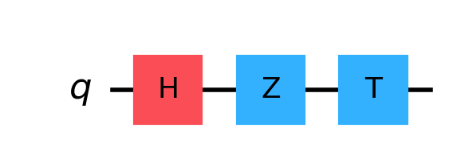

## **Introduction to Quantum Computing**

Quantum computing represents a transformative leap in computational technology. Unlike classical computers, which use bits as the smallest unit of data, quantum computers employ quantum bits, or qubits. These qubits take advantage of the principles of quantum mechanics, allowing for exponentially greater processing power in certain types of computations.

**Core Concepts:**

- **Superposition:** Unlike classical bits that can be either 0 or 1, qubits can exist in a state that is a superposition of both. This property allows quantum computers to process a massive amount of data simultaneously.
- **Entanglement:** Qubits can become entangled, meaning the state of one qubit can depend on the state of another, no matter the distance between them. This interdependence enables complex correlations and faster computation.
- **Quantum Interference:** Quantum systems can interfere with themselves, meaning probabilities can add or subtract based on the wave-like nature of qubits. This phenomenon can be harnessed to reduce errors and optimize outcomes in computations.

Quantum computers hold the promise of solving problems that are intractable for classical computers, such as factoring large numbers, simulating quantum physics, and optimizing complex systems.

## **Mathematical Basis of Quantum Computing**

Quantum computing's power stems from its unique use of quantum mechanics to represent and manipulate data. This section provides a detailed look into the mathematical principles that underpin quantum computing.

### **Quantum States and Qubits**

In quantum computing, information is encoded in quantum states of qubits. A qubit is the quantum analog of a classical bit, but it can exist in a superposition of the two basis states $|0⟩$ and $|1⟩$.

1. **State Representation:**
   A qubit is represented as a vector in a two-dimensional complex vector space, commonly denoted as $|ψ⟩$. The general state of a qubit is given by:
   $$
   |ψ⟩ = α|0⟩ + β|1⟩
   $$
   Here, $α$ and $β$ are complex numbers called probability amplitudes, satisfying the normalization condition:
   $$
   |α|^2 + |β|^2 = 1
   $$
   This condition ensures that the total probability of the qubit being in state $|0⟩$ or $|1⟩$ is 1.

2. **Dirac Notation:**
   The vector form $|ψ⟩$ is often written in Dirac or bra-ket notation, which is a convenient way to describe quantum states. The basis states $|0⟩$ and $|1⟩$ are the eigenstates of the Pauli Z operator (more on this below).

### **Quantum Gates and Operations**

Quantum gates are the building blocks of quantum circuits, analogous to classical logic gates. They are represented by unitary matrices that act on the state vectors of qubits. Unitarity ensures that the operation preserves the total probability (i.e., it remains 1).

1. **Pauli Matrices:**
   The Pauli matrices are fundamental in quantum mechanics and quantum computing. They describe basic quantum operations and are used to represent qubit rotations.

   - **Pauli-X (NOT Gate):**
     $$
     X = \begin{pmatrix}
     0 & 1 \\
     1 & 0
     \end{pmatrix}
     $$
     This gate flips the state of a qubit: $X|0⟩ = |1⟩$ and $X|1⟩ = |0⟩$.

   - **Pauli-Y:**
     $$
     Y = \begin{pmatrix}
     0 & -i \\
     i & 0
     \end{pmatrix}
     $$
     The Pauli-Y gate applies a phase shift and flips the state with a complex phase factor $i$.

   - **Pauli-Z (Phase Flip):**
     $$
     Z = \begin{pmatrix}
     1 & 0 \\
     0 & -1
     \end{pmatrix}
     $$
     This gate flips the phase of the qubit’s state: $Z|0⟩ = |0⟩$ and $Z|1⟩ = -|1⟩$.

2. **Hadamard Gate:**
   The Hadamard gate creates a superposition of states. It transforms the basis states as follows:
   $$
   H = \frac{1}{\sqrt{2}} \begin{pmatrix}
   1 & 1 \\
   1 & -1
   \end{pmatrix}
   $$
   - $H|0⟩ = \frac{1}{\sqrt{2}} (|0⟩ + |1⟩)$
   - $H|1⟩ = \frac{1}{\sqrt{2}} (|0⟩ - |1⟩)$

3. **Controlled NOT (CNOT) Gate:**
   The CNOT gate is a two-qubit operation that flips the state of the target qubit if the control qubit is in state $|1⟩$.
   $$
   CNOT = \begin{pmatrix}
   1 & 0 & 0 & 0 \\
   0 & 1 & 0 & 0 \\
   0 & 0 & 0 & 1 \\
   0 & 0 & 1 & 0
   \end{pmatrix}
   $$
   The matrix operates on a 4-dimensional space corresponding to the possible states of two qubits.

4. **Phase Gates:**
   - **S Gate:**
     $$
     S = \begin{pmatrix}
     1 & 0 \\
     0 & i
     \end{pmatrix}
     $$
     The S gate introduces a phase shift of $π/2$.

   - **T Gate:**
     $$
     T = \begin{pmatrix}
     1 & 0 \\
     0 & e^{iπ/4}
     \end{pmatrix}
     $$
     The T gate introduces a phase shift of $π/4$.

### **Quantum Measurement**

Measurement in quantum computing collapses a quantum state into one of the basis states, which can be observed as classical information. The probabilities of the outcomes are determined by the amplitudes of the state vector components.

1. **Measurement in the Computational Basis:**
   The outcome of measuring a qubit in the computational basis $\{|0⟩, |1⟩\}$ is probabilistically determined by:
   $$
   P(0) = |α|^2 \quad \text{and} \quad P(1) = |β|^2
   $$
   where $ |α|^2 $ and $ |β|^2 $ are the squared magnitudes of the respective probability amplitudes.

2. **Projective Measurement:**
   Measurement can be described using projection operators. For a qubit state $|ψ⟩ = α|0⟩ + β|1⟩$, the measurement operator for state $|0⟩$ is:
   $$
   P_0 = |0⟩⟨0|
   $$
   After the measurement, the state collapses to $|0⟩$ or $|1⟩$ with the respective probabilities, and the post-measurement state reflects this collapse.

3. **Measurement in Different Bases:**
   Measurements can also be performed in other bases, such as the $\{|+\rangle, |-\rangle\}$ basis, where $|+\rangle = \frac{1}{\sqrt{2}}(|0\rangle + |1\rangle)$ and $|-\rangle = \frac{1}{\sqrt{2}}(|0\r

angle - |1\rangle)$. The probabilities and post-measurement states differ depending on the chosen basis.

## **Quantum Circuit Example with Qiskit**

To solidify the understanding of these concepts, let’s look at a practical example using Qiskit to implement a simple quantum circuit.


### Example 1 
1-qbit system: analyze matrix multiplication and operators effects. Each operation will be evaluated step-by-step for learning purposes :

1. Apply Hadamant (H) Operator to $|0⟩$
2. Apply Z or ($\sigma_z$)
3. Apply T
4. Apply H again 

<!-- ```python
# Import the necessary Qiskit modules
from qiskit import QuantumCircuit
from qiskit_aer import AerSimulator
from qiskit.visualization import plot_histogram
from qiskit.quantum_info import Statevector

circuit = QuantumCircuit(1)

circuit.h(0)
circuit.z(0)
circuit.t(0)
circuit.h(0)

circuit.draw('mpl', scale=2)
```


    

    

 -->


<!-- ```python
# ket0 = Statevector([1, 0])
# v = ket0.evolve(circuit)
# v.draw("text")
``` -->


<!-- > [0.14644661-0.35355339j,0.85355339+0.35355339j] -->


#### Step 1 - Apply H
The Hadamant Operator should make the ket0 equally probable for on 0 and 1 state.


```python
circuit = QuantumCircuit(1)

circuit.h(0)
plt = circuit.draw('mpl', scale=2)
display(plt)

ket0 = Statevector([1, 0])
v = ket0.evolve(circuit)
v.draw("latex")

```


    

    

$$\frac{\sqrt{2}}{2} |0\rangle+\frac{\sqrt{2}}{2} |1\rangle$$


#### Step 2 - Apply Z
The Z operator is *phase_flip*, hence $\ket{1}$ coefficient will change sign.


```python
circuit = QuantumCircuit(1)

circuit.h(0)
circuit.z(0)
plt = circuit.draw('mpl', scale=2)
display(plt)

ket0 = Statevector([1, 0])
v = ket0.evolve(circuit)
v.draw("latex")

```


    

    


$$\frac{\sqrt{2}}{2} |0\rangle- \frac{\sqrt{2}}{2} |1\rangle$$


#### Step 3 - Apply T
**T** operator applies a phase shift of $\pi/4$, so we expect a change in $\ket{1}$ coefficient. Precisely that coefficient will multiplied by $\frac{\sqrt{2}}{2}(1+i)$


```python
circuit = QuantumCircuit(1)

circuit.h(0)
circuit.z(0)
circuit.t(0)
plt = circuit.draw('mpl', scale=2)
display(plt)

ket0 = Statevector([1, 0])
v = ket0.evolve(circuit)
v.draw("latex")
```


    
$$\frac{\sqrt{2}}{2} |0\rangle+(- \frac{1}{2} - \frac{i}{2}) |1\rangle$$


#### Step 4 - Apply H again


```python
circuit = QuantumCircuit(1)

circuit.h(0)
circuit.z(0)
circuit.t(0)
circuit.h(0)
plt = circuit.draw('mpl', scale=2)
display(plt)

ket0 = Statevector([1, 0])
v = ket0.evolve(circuit)
v.draw("latex")

```


    

    


$$(0.1464466094 - 0.3535533906 i) |0\rangle+(0.8535533906 + 0.3535533906 i) |1\rangle$$


```python
print(v.probabilities_dict()) # Aritmetic Probability

n_samples = 5000
statistics = v.sample_counts(n_samples)
static_prob = {"0": statistics['0']/n_samples, "1": statistics["1"]/n_samples}
plot_histogram(statistics, figsize=(12, 8))
print(static_prob)
```

>    {'0': 0.1464466094067262, '1': 0.8535533905932733} # arithmetic
> 
>    {'0': 0.1406, '1': 0.8594}  # statistical sampling
    

### Example 2 - Bell State


```python
# Import the necessary Qiskit modules
from qiskit import QuantumCircuit
from qiskit_aer import AerSimulator
from qiskit.visualization import plot_histogram

# Create a quantum circuit with 2 qubits and 2 classical bits
qc = QuantumCircuit(2)

# Apply a Hadamard gate to the first qubit
qc.h(0)

# Apply a CNOT gate with control qubit 0 and target qubit 1
qc.cx(0, 1)

# Measure both qubits
# qc.measure([0, 1], [0, 1])

# Deaw the circuit
qc.draw('mpl', scale=3)
```

    

    


```python
# Set up six different observables.
from qiskit.quantum_info import SparsePauliOp
 
observables_labels = ["ZZ", "ZI", "IZ", "XX", "XI", "IX"]
observables = [SparsePauliOp(label) for label in observables_labels]

observables
```
<!-- 

    [SparsePauliOp(['ZZ'],
                   coeffs=[1.+0.j]),
     SparsePauliOp(['ZI'],
                   coeffs=[1.+0.j]),
     SparsePauliOp(['IZ'],
                   coeffs=[1.+0.j]),
     SparsePauliOp(['XX'],
                   coeffs=[1.+0.j]),
     SparsePauliOp(['XI'],
                   coeffs=[1.+0.j]),
     SparsePauliOp(['IX'],
                   coeffs=[1.+0.j])] -->


#### Optimize 


```python
from qiskit_aer.primitives import Estimator

estimator = Estimator()

job = estimator.run([qc]*len(observables), observables)
job.result()
```
<!-- 

    EstimatorResult(values=array([ 1.        , -0.03125   , -0.03125   ,  1.        , -0.03710938,
           -0.03710938]), metadata=[{'shots': 1024, 'variance': 0.0, 'simulator_metadata': [{'batched_shots_optimization': False, 'required_memory_mb': 0, 'method': 'stabilizer', 'active_input_qubits': [0, 1], 'device': 'CPU', 'remapped_qubits': False, 'num_qubits': 2, 'num_clbits': 2, 'time_taken': 0.0050854, 'sample_measure_time': 0.001718, 'input_qubit_map': [[0, 0], [1, 1]], 'max_memory_mb': 7563, 'measure_sampling': True, 'noise': 'ideal', 'parallel_shots': 1, 'parallel_state_update': 16, 'runtime_parameter_bind': False, 'num_bind_params': 1, 'fusion': {'enabled': False}}]}, {'shots': 1024, 'variance': 0.9990234375, 'simulator_metadata': [{'batched_shots_optimization': False, 'required_memory_mb': 0, 'method': 'stabilizer', 'active_input_qubits': [0, 1], 'device': 'CPU', 'remapped_qubits': False, 'num_qubits': 2, 'num_clbits': 2, 'time_taken': 0.0050854, 'sample_measure_time': 0.001718, 'input_qubit_map': [[0, 0], [1, 1]], 'max_memory_mb': 7563, 'measure_sampling': True, 'noise': 'ideal', 'parallel_shots': 1, 'parallel_state_update': 16, 'runtime_parameter_bind': False, 'num_bind_params': 1, 'fusion': {'enabled': False}}]}, {'shots': 1024, 'variance': 0.9990234375, 'simulator_metadata': [{'batched_shots_optimization': False, 'required_memory_mb': 0, 'method': 'stabilizer', 'active_input_qubits': [0, 1], 'device': 'CPU', 'remapped_qubits': False, 'num_qubits': 2, 'num_clbits': 2, 'time_taken': 0.0050854, 'sample_measure_time': 0.001718, 'input_qubit_map': [[0, 0], [1, 1]], 'max_memory_mb': 7563, 'measure_sampling': True, 'noise': 'ideal', 'parallel_shots': 1, 'parallel_state_update': 16, 'runtime_parameter_bind': False, 'num_bind_params': 1, 'fusion': {'enabled': False}}]}, {'shots': 1024, 'variance': 0.0, 'simulator_metadata': [{'batched_shots_optimization': False, 'required_memory_mb': 0, 'method': 'stabilizer', 'active_input_qubits': [0, 1], 'device': 'CPU', 'remapped_qubits': False, 'num_qubits': 2, 'num_clbits': 2, 'time_taken': 0.003552, 'sample_measure_time': 0.0013732, 'input_qubit_map': [[0, 0], [1, 1]], 'max_memory_mb': 7563, 'measure_sampling': True, 'noise': 'ideal', 'parallel_shots': 1, 'parallel_state_update': 16, 'runtime_parameter_bind': False, 'num_bind_params': 1, 'fusion': {'enabled': False}}]}, {'shots': 1024, 'variance': 0.9986228942871094, 'simulator_metadata': [{'batched_shots_optimization': False, 'required_memory_mb': 0, 'method': 'stabilizer', 'active_input_qubits': [0, 1], 'device': 'CPU', 'remapped_qubits': False, 'num_qubits': 2, 'num_clbits': 2, 'time_taken': 0.003552, 'sample_measure_time': 0.0013732, 'input_qubit_map': [[0, 0], [1, 1]], 'max_memory_mb': 7563, 'measure_sampling': True, 'noise': 'ideal', 'parallel_shots': 1, 'parallel_state_update': 16, 'runtime_parameter_bind': False, 'num_bind_params': 1, 'fusion': {'enabled': False}}]}, {'shots': 1024, 'variance': 0.9986228942871094, 'simulator_metadata': [{'batched_shots_optimization': False, 'required_memory_mb': 0, 'method': 'stabilizer', 'active_input_qubits': [0, 1], 'device': 'CPU', 'remapped_qubits': False, 'num_qubits': 2, 'num_clbits': 2, 'time_taken': 0.003552, 'sample_measure_time': 0.0013732, 'input_qubit_map': [[0, 0], [1, 1]], 'max_memory_mb': 7563, 'measure_sampling': True, 'noise': 'ideal', 'parallel_shots': 1, 'parallel_state_update': 16, 'runtime_parameter_bind': False, 'num_bind_params': 1, 'fusion': {'enabled': False}}]}])

 -->


```python
# post-processing
import matplotlib.pyplot as plt

values = job.result().values

plt.plot(observables_labels, values, '-o')
plt.show()
```


    

    


As expect from the *Bell State*, only the correlated two-qubits observables like (XX or ZZ) have a non-zero probablity.

<!-- ```python
# # Create a simulator
# simulator = AerSimulator()

# # Run the quantum circuit on the simulator backend
# job = simulator.run(qc, shots=n_samples)

# # Get the results of the simulation
# result = job.result()

# # Get the counts of measurement outcomes
# counts = result.get_counts(qc)

# # Print the results
# print("\nMeasurement outcomes:", counts)

# # Visualize the results
# plot_histogram(counts, figsize=(12,8))
``` -->

<!-- 
This circuit uses a Hadamard gate to place the qubit into an equal superposition of $|0⟩$ and $|1⟩$. The measurement collapses the state, and the histogram shows the distribution of measurement outcomes over many trials, ideally 50% $|0⟩$ and 50% $|1⟩$. -->

## **Conclusion**

Understanding the mathematical basis of quantum computing is essential for grasping how quantum computers operate. From the representation of qubits to the actions of quantum gates and the process of measurement, these principles form the foundation upon which quantum algorithms are built. This deeper understanding helps appreciate the transformative potential of quantum computing in solving complex problems that classical computers struggle with.

For a comprehensive learning experience, explore the delightful course [IBM Quantum Computing Learning platform](https://learning.quantum.ibm.com/course/basics-of-quantum-information/).

### Next Steps
In the next articles, we are going to play with more complex and useful quantum circuits to explore the real capabilities of this world.

<!-- Link to next articles -->

